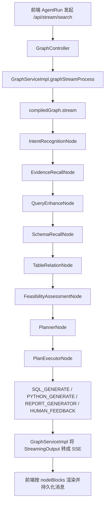
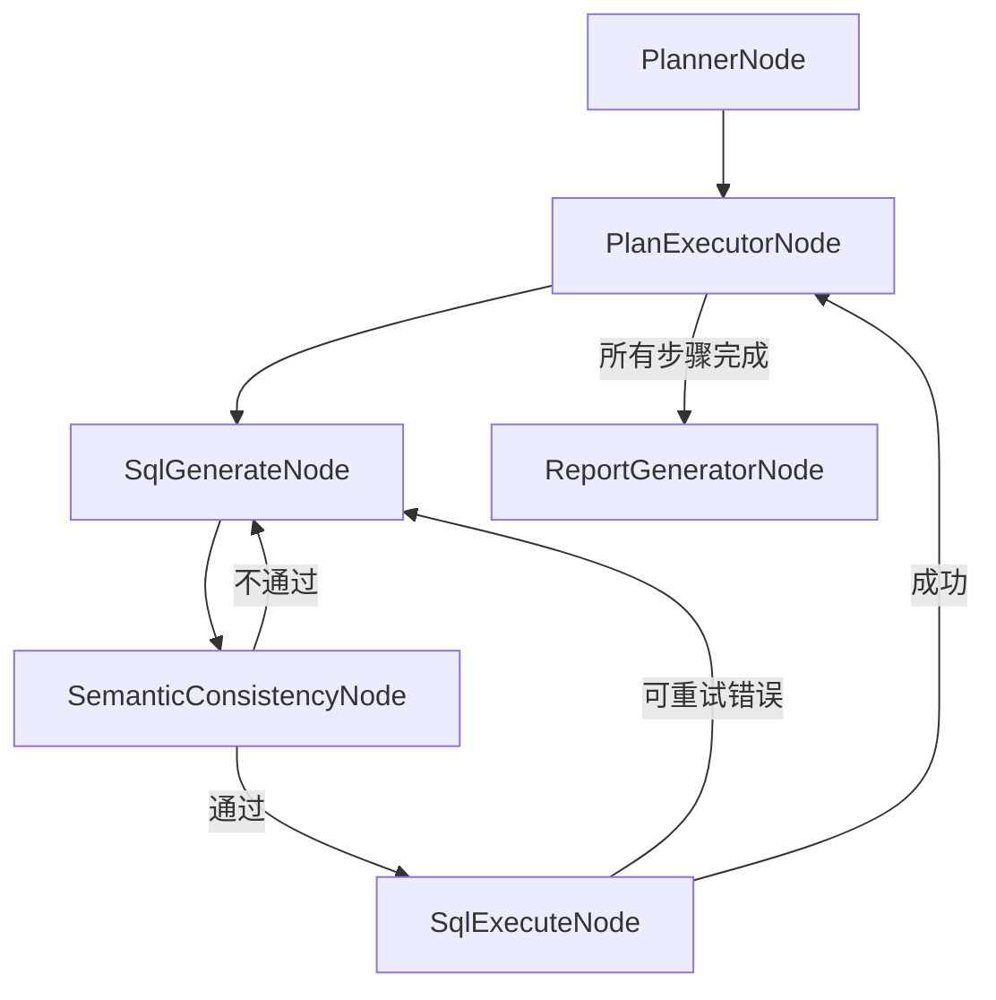
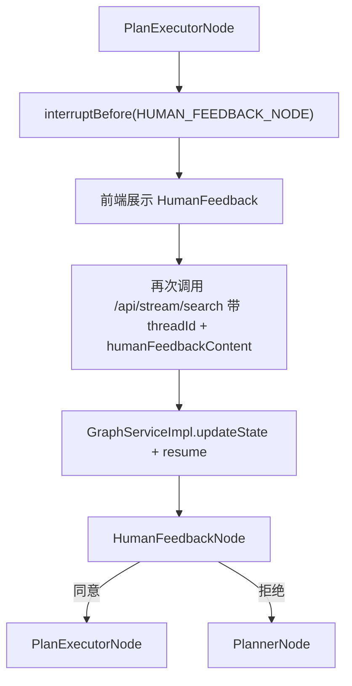

# `/api/stream/search` 接口详细流程分析

## 1. 分析目标

本文基于当前仓库代码，对 `GET /api/stream/search` 的真实执行链路做一次“从前端到后端、从编排到落库/流式返回”的完整梳理，覆盖：

1. 前端如何发起请求、消费 SSE、保存会话消息。
2. 后端 `GraphController -> GraphServiceImpl -> StateGraph` 的入口和状态流转。
3. 各个 Graph Node/Dispatcher 的职责、状态键、回环条件和结束条件。
4. 向量召回、Schema 召回、NL2SQL、SQL 执行、Python 分析、报告生成在链路中的位置。
5. 人工反馈、停止流式、错误处理、多轮上下文的实际行为。

结论先行：

- `/api/stream/search` 不是一个“单纯查库接口”，而是一个“前端驱动的流式工作流接口”。
- 真正的核心不在 Controller，而在 `GraphServiceImpl` 驱动的 `nl2sqlGraph`。
- 会话消息持久化不发生在 `/api/stream/search` 内部，而是由前端额外调用 `/api/sessions/{sessionId}/messages` 保存。
- 人工反馈不是新开一条工作流，而是基于同一个 `threadId` 恢复已中断的图状态继续跑。

---

## 2. 参与模块总览

### 2.1 前端入口

- `data-agent-frontend/src/views/AgentRun.vue`
- `data-agent-frontend/src/services/graph.ts`
- `data-agent-frontend/src/services/chat.ts`
- `data-agent-frontend/src/services/sessionStateManager.ts`

### 2.2 后端入口

- `data-agent-management/src/main/java/com/alibaba/cloud/ai/dataagent/controller/GraphController.java`
- `data-agent-management/src/main/java/com/alibaba/cloud/ai/dataagent/service/graph/GraphServiceImpl.java`

### 2.3 编排与执行核心

- `data-agent-management/src/main/java/com/alibaba/cloud/ai/dataagent/config/DataAgentConfiguration.java`
- `data-agent-management/src/main/java/com/alibaba/cloud/ai/dataagent/workflow/node/*.java`
- `data-agent-management/src/main/java/com/alibaba/cloud/ai/dataagent/workflow/dispatcher/*.java`

### 2.4 关键支撑服务

- `service/nl2sql/Nl2SqlServiceImpl.java`
- `service/schema/SchemaServiceImpl.java`
- `service/vectorstore/AgentVectorStoreServiceImpl.java`
- `util/DatabaseUtil.java`
- `service/llm/*`

### 2.5 会话/消息持久化

- `data-agent-management/src/main/java/com/alibaba/cloud/ai/dataagent/controller/ChatController.java`

---

## 3. 接口契约

## 3.1 请求方式

- 方法：`GET`
- 路径：`/api/stream/search`
- 返回：`text/event-stream`

### 3.2 请求参数

`GraphController.streamSearch()` 将查询参数组装为 `GraphRequest`：

- `agentId`：必填，智能体 ID
- `threadId`：可选，会话线程 ID；为空时后端自动生成
- `query`：必填，用户问题
- `humanFeedback`：是否启用人工反馈模式
- `humanFeedbackContent`：人工反馈内容
- `rejectedPlan`：是否拒绝上一版计划
- `nl2sqlOnly`：是否只走 NL2SQL 简化模式，默认 `false`

### 3.3 SSE 数据体

后端输出的数据对象是 `GraphNodeResponse`，字段如下：

- `agentId`
- `threadId`
- `nodeName`
- `textType`
- `text`
- `error`
- `complete`

其中：

- 普通 chunk 走默认 SSE `message` 事件。
- 完成事件走 `event: complete`。
- 异常事件走 `event: error`。

### 3.4 一个容易忽略的事实

后端确实会发自定义 `error` 事件，但前端 `graph.ts` 只显式监听了：

- `onmessage`
- `onerror`
- `addEventListener('complete', ...)`

它没有单独 `addEventListener('error', ...)` 去消费后端自定义错误消息，所以当前 UI 更容易把异常统一表现成 `Stream connection failed`，这也是项目调优笔记里提到“流式失败提示过于笼统”的根因之一。

---

## 4. 前端发起链路

## 4.1 发送消息前做了什么

`AgentRun.vue` 中 `sendMessage()` 的执行顺序是：

1. 校验输入非空，且当前未在流式处理中。
2. 先把用户消息通过 `ChatService.saveMessage()` 持久化到 `/api/sessions/{sessionId}/messages`。
3. 组装 `GraphRequest`：
   - `agentId = 当前页面 agentId`
   - `query = 用户输入`
   - `humanFeedback = 面板开关`
   - `nl2sqlOnly = 面板开关`
   - `rejectedPlan = false`
   - `humanFeedbackContent = null`
   - `threadId = sessionState.lastRequest?.threadId || null`
4. 调用 `sendGraphRequest()`，真正发起 `/api/stream/search`。

这里非常关键：

- 聊天消息落库与 `/api/stream/search` 没有耦合。
- `/api/stream/search` 只负责“跑工作流并流式吐 chunk”。
- 用户消息、节点块、报告消息的存储，全部是前端额外调用 Chat 接口完成。

## 4.2 前端如何建立 SSE

`graph.ts` 的 `streamSearch()` 做的事很直接：

1. 用 `URLSearchParams` 组装 query string。
2. 创建 `EventSource('/api/stream/search?...')`。
3. 在 `onmessage` 中把 `event.data` 解析为 `GraphNodeResponse`。
4. 在 `complete` 事件中关闭连接。
5. 在 `onerror` 中报 `Stream connection failed` 并关闭连接。

## 4.3 前端如何组织流式展示

`AgentRun.vue` 中 `sendGraphRequest()` 会把流式响应按“节点块”组织：

- 相同 `nodeName` 的 chunk 尽量归入同一个 `nodeBlocks[currentBlockIndex]`
- `ReportGeneratorNode` 单独处理：
  - `MARK_DOWN` 片段持续拼接到 `markdownReportContent`
  - `HTML` 片段持续拼接到 `htmlReportContent`
- `RESULT_SET` 单独作为结果集块处理

完成时：

- 普通节点块会被转成 HTML 消息保存
- Markdown 报告会保存成 `messageType = markdown-report`
- HTML 报告会保存成 `messageType = html-report`

也就是说，运行页上看到的流式过程，本质是“前端边接 SSE，边做节点分组，流结束后再分段持久化”。

---

## 5. 后端入口链路

## 5.1 GraphController

`GraphController.streamSearch()` 只做四件事：

1. 设置 SSE 响应头：
   - `Cache-Control: no-cache`
   - `Connection: keep-alive`
   - `Access-Control-Allow-Origin: *`
2. 创建 `Sinks.Many<ServerSentEvent<GraphNodeResponse>>`
3. 组装 `GraphRequest`
4. 调用 `graphService.graphStreamProcess(sink, request)`

之后 Controller 返回 `sink.asFlux()`，并附带四个行为：

- `filter(...)`
  - `complete/error` 事件直接透传
  - 其余事件只有 `text` 非空才透传
- `doOnCancel(...)`
  - 客户端断开时调用 `graphService.stopStreamProcessing(threadId)`
- `doOnError(...)`
  - 流错误时也执行停止清理
- `doOnComplete(...)`
  - 记录日志

## 5.2 GraphServiceImpl 总入口

`graphStreamProcess()` 是 `/api/stream/search` 真正的逻辑入口：

1. 如果没有 `threadId`，生成 UUID。
2. 用 `threadId` 从 `streamContextMap` 取或创建 `StreamContext`。
3. 把前端传入的 `sink` 放进 `StreamContext`。
4. 根据请求分两条路径：
   - 有 `humanFeedbackContent`：`handleHumanFeedback()`
   - 没有：`handleNewProcess()`

这里的设计意味着：

- 一个 `threadId` 对应一次图执行上下文。
- 同一个 `threadId` 可用于后续人工反馈恢复。
- `StreamContext` 里保存了 `sink`、`Disposable`、`Span`、`TextType`、收集中的输出内容。

---

## 6. StateGraph 是怎么挂起来的

## 6.1 编排图定义位置

工作流图定义在：

- `DataAgentConfiguration.nl2sqlGraph()`

`GraphServiceImpl` 构造时会把它编译成：

- `compiledGraph = stateGraph.compile(CompileConfig.builder().interruptBefore(HUMAN_FEEDBACK_NODE).build())`

这里的 `interruptBefore(HUMAN_FEEDBACK_NODE)` 很重要：

- 人工审核开启时，图不会直接执行 `HumanFeedbackNode`
- 它会先在该节点前中断，等待外部通过 `updateState + resume` 注入反馈后继续

## 6.2 核心状态键

图里几乎所有关键节点都通过状态键传递数据，重要的有：

- 输入与上下文
  - `INPUT_KEY`
  - `AGENT_ID`
  - `MULTI_TURN_CONTEXT`
  - `TRACE_THREAD_ID`
- 召回与 Schema
  - `EVIDENCE`
  - `QUERY_ENHANCE_NODE_OUTPUT`
  - `TABLE_DOCUMENTS_FOR_SCHEMA_OUTPUT`
  - `COLUMN_DOCUMENTS__FOR_SCHEMA_OUTPUT`
  - `TABLE_RELATION_OUTPUT`
  - `GENEGRATED_SEMANTIC_MODEL_PROMPT`
  - `DB_DIALECT_TYPE`
- 计划与执行
  - `PLANNER_NODE_OUTPUT`
  - `PLAN_CURRENT_STEP`
  - `PLAN_NEXT_NODE`
  - `PLAN_VALIDATION_STATUS`
  - `PLAN_VALIDATION_ERROR`
  - `PLAN_REPAIR_COUNT`
- SQL/Python
  - `SQL_GENERATE_OUTPUT`
  - `SQL_GENERATE_COUNT`
  - `SQL_REGENERATE_REASON`
  - `SQL_EXECUTE_NODE_OUTPUT`
  - `SQL_RESULT_LIST_MEMORY`
  - `PYTHON_GENERATE_NODE_OUTPUT`
  - `PYTHON_EXECUTE_NODE_OUTPUT`
  - `PYTHON_ANALYSIS_NODE_OUTPUT`
  - `PYTHON_IS_SUCCESS`
  - `PYTHON_TRIES_COUNT`
  - `PYTHON_FALLBACK_MODE`
- 人工反馈
  - `HUMAN_REVIEW_ENABLED`
  - `HUMAN_FEEDBACK_DATA`

这些状态键在 `DataAgentConfiguration` 里基本都配置成 `KeyStrategy.REPLACE`。  
其中 `SQL_RESULT_LIST_MEMORY` 虽然是替换策略，但 `SqlExecuteNode` 每次都会先读取旧列表再合并当前 step，所以最终效果是“整份累积列表整体回写”。

---

## 7. 正常首轮请求的详细执行过程

下面按“初次提问，非人工反馈恢复”的路径拆解。

## 7.1 建图初始状态

`handleNewProcess()` 会构造图的初始 state：

- `IS_ONLY_NL2SQL = nl2sqlOnly`
- `INPUT_KEY = query`
- `AGENT_ID = agentId`
- `HUMAN_REVIEW_ENABLED = humanFeedback && !nl2sqlOnly`
- `MULTI_TURN_CONTEXT = multiTurnContextManager.buildContext(threadId)`
- `TRACE_THREAD_ID = threadId`

同时：

1. `multiTurnContextManager.beginTurn(threadId, query)` 记录本轮待完成对话。
2. 调用 `compiledGraph.stream(initialState, RunnableConfig.threadId(threadId))`
3. 由 `subscribeToFlux()` 在独立线程池中订阅图输出

## 7.2 图输出如何变成 SSE

Graph 的输出类型是 `NodeOutput`。  
`GraphServiceImpl.handleNodeOutput()` 只处理其中的 `StreamingOutput`。

随后 `handleStreamNodeOutput()` 会：

1. 读取 `output.node()` 和 `output.chunk()`
2. 利用 `TextType` 的开始/结束标记识别内容类型：
   - `$$$json`
   - `$$$sql`
   - `$$$python`
   - `$$$result_set`
   - `$$$markdown-report`
3. 标记切换本身不会发给前端，只用于切换 `textType`
4. 真正内容 chunk 会：
   - 追加到 `StreamContext.outputCollector`
   - 如果来自 `PlannerNode`，额外追加到 `MultiTurnContextManager` 的本轮 plan 缓冲
   - 封装成 `GraphNodeResponse`
   - 通过 `sink.tryEmitNext(ServerSentEvent.builder(response).build())` 推给前端

因此，前端收到的不是节点最终结果，而是每个节点内部包装过的流式片段。

## 7.3 流结束和异常结束

### 正常结束

`handleStreamComplete()`：

1. `multiTurnContextManager.finishTurn(threadId)`，把本轮 `用户问题 + Planner 输出` 写入历史上下文
2. 发送 `event: complete`
3. 关闭 sink，回收 `StreamContext`
4. 用 `LangfuseService` 上报成功 span

### 异常结束

`handleStreamError()`：

1. 从 `streamContextMap` 移除上下文
2. 上报 Langfuse error span
3. 发送 `event: error`，数据体里是 `GraphNodeResponse.error(...)`
4. 完成 sink 并 cleanup

### 用户主动停止

前端 `stopStreaming()` 会关闭 `EventSource`。  
服务端 `GraphController.doOnCancel()` 会触发 `graphService.stopStreamProcessing(threadId)`：

1. `multiTurnContextManager.discardPending(threadId)`
2. 移除并清理 `StreamContext`
3. dispose 图订阅
4. 结束 Langfuse span

---

## 8. 工作流节点详细流程

## 8.1 IntentRecognitionNode

职责：

- 基于 `INPUT_KEY + MULTI_TURN_CONTEXT` 调 LLM 做意图识别
- 解析成 `IntentRecognitionOutputDTO`
- 写入 `INTENT_RECOGNITION_NODE_OUTPUT`

路由：

- `IntentRecognitionDispatcher`
  - 分类为“闲聊或无关指令” -> `END`
  - 否则 -> `EVIDENCE_RECALL_NODE`

含义：

- `/api/stream/search` 不是任何问题都进入 NL2SQL，先经过一次入口分流。

## 8.2 EvidenceRecallNode

职责分两段：

1. 先把问题重写成更适合召回的 standalone query
2. 再基于向量库召回证据

实际过程：

1. 用 `PromptHelper.buildEvidenceQueryRewritePrompt()` 调 LLM
2. 解析出 standalone query
3. 调 `AgentVectorStoreService.getDocumentsForAgent(...)` 召回两类文档：
   - `BUSINESS_TERM`
   - `AGENT_KNOWLEDGE`
4. 组装成 `EVIDENCE` 字符串写回状态
5. 额外把“重写后的查询”和“召回到的证据摘要”流式展示给前端

依赖：

- `AgentVectorStoreServiceImpl`
  - 先按 `agentId + vectorType` 生成 filter
  - 可走 hybrid retrieval，也可退化为单纯 vector similarity search

如果召回不到：

- `EVIDENCE` 会是空/“无”
- 流程仍可继续，但下游提示词上下文会明显变弱

## 8.3 QueryEnhanceNode

职责：

- 基于 `原始问题 + evidence + 多轮上下文` 做问题增强
- 输出 `QueryEnhanceOutputDTO`
  - `canonicalQuery`
  - `expandedQueries`

路由：

- `QueryEnhanceDispatcher`
  - `canonicalQuery` 为空或 `expandedQueries` 为空 -> `END`
  - 否则 -> `SCHEMA_RECALL_NODE`

实际意义：

- 后续 schema recall、SQL 生成、可行性判断基本都优先用 `canonicalQuery`

## 8.4 SchemaRecallNode

这是 `/stream/search` 里最关键的“数据库语义入口”之一。

职责：

1. 找当前 agent 的激活数据源
2. 基于 `canonicalQuery` 或 fallback `expandedQueries` 召回表文档
3. 基于召回表名补召回列文档
4. 对管网类问题做强制补表

实际逻辑：

1. 从 `AgentDatasourceMapper` 查 active datasource
2. 首轮召回使用：
   - `canonicalQuery`
3. fallback 召回使用：
   - `expandedQueries`
4. `SchemaServiceImpl.getTableDocumentsByDatasource()` 不是单一检索，而是三路合并：
   - 精确表名匹配
   - 关键词匹配
   - 向量语义召回
5. 如果识别到管网前缀（如 `HZGS`、`WS`、`*_lin`、`*_nod`、`*_M_MT`、`*_M_MT_FLD`），会额外把这些表强制补进来
6. 根据召回到的表名，再查对应列文档

路由：

- `SchemaRecallDispatcher`
  - 召回到表文档 -> `TABLE_RELATION_NODE`
  - 首轮没召回到，但有 expandedQueries -> 再跑一次 `SCHEMA_RECALL_NODE`
  - fallback 之后仍无结果 -> `END`

这里和项目里的管网专项调优笔记是直接关联的：

- 管网问题容易因为前缀表未完整召回导致下游 planner/semantic consistency 回环
- 当前代码已经在 `SchemaRecallNode` 增加了 prefix 识别和强制补表逻辑

## 8.5 TableRelationNode

职责：

1. 把表文档 + 列文档组装成 `SchemaDTO`
2. 通过逻辑外键补充关系
3. 生成候选语义模型提示
4. 调 `Nl2SqlService.fineSelect(...)` 做精细选表

关键细节：

- `SchemaServiceImpl.buildSchemaFromDocuments()`
  - 从表文档构建 `TableDTO`
  - 根据列文档挂载列信息
  - 根据外键信息补缺表/缺列
- `getLogicalForeignKeys()`
  - 从 datasource 里拿逻辑关系
  - 只保留与本轮召回表相关的关系
- `fineSelect(...)`
  - 用 `buildMixSelectorPrompt(...)` 让 LLM 从候选 schema 中进一步筛表
  - 如果上游曾给过 `SQL_GENERATE_SCHEMA_MISSING_ADVICE`，还会做一次“按补表建议二次筛选”

输出状态：

- `TABLE_RELATION_OUTPUT = SchemaDTO`
- `DB_DIALECT_TYPE`
- `GENEGRATED_SEMANTIC_MODEL_PROMPT`
- `TABLE_RELATION_EXCEPTION_OUTPUT`

路由：

- `TableRelationDispatcher`
  - 有异常标记 -> `END`
  - 有 `TABLE_RELATION_OUTPUT` -> `FEASIBILITY_ASSESSMENT_NODE`
  - 否则 -> `END`

## 8.6 FeasibilityAssessmentNode

职责：

- 用 `canonicalQuery + recalledSchema + evidence + semanticModel + multiTurn` 做可行性评估

输出：

- `FEASIBILITY_ASSESSMENT_NODE_OUTPUT`

路由：

- `FeasibilityAssessmentDispatcher`
  - 判断为“数据分析需求” -> `PLANNER_NODE`
  - 否则 -> `END`

这一步的作用是：

- 在真正进入复杂计划执行前，再判断一次是否值得走分析链

## 8.7 PlannerNode

职责：

- 生成执行计划 `Plan`
- 或在 `nl2sqlOnly=true` 时直接返回内置的 `Plan.nl2SqlPlan()`

正常模式下，它会把这些东西塞进 planner prompt：

- `canonicalQuery`
- `schema`
- `evidence`
- `semanticModel`
- 若有人工反馈/计划修复，还会带上 `PLAN_VALIDATION_ERROR`

输出：

- `PLANNER_NODE_OUTPUT`

注意：

- `GraphServiceImpl.handleStreamNodeOutput()` 会把 `PlannerNode` 的 chunk 额外记录进 `MultiTurnContextManager`
- 所以后续多轮上下文里，保留下来的不是整个最终报告，而是“用户问题 + 上一轮 planner 输出”

## 8.8 PlanExecutorNode

职责：

1. 校验 plan JSON 结构
2. 校验每个 step 的 `toolToUse` 与参数
3. 决定下一个执行节点

支持的工具节点只有三类：

- `SQL_GENERATE_NODE`
- `PYTHON_GENERATE_NODE`
- `REPORT_GENERATOR_NODE`

关键逻辑：

- 若 plan 校验失败：
  - 设置 `PLAN_VALIDATION_STATUS=false`
  - 设置 `PLAN_VALIDATION_ERROR`
  - `PLAN_REPAIR_COUNT + 1`
  - 由 `PlanExecutorDispatcher` 送回 `PLANNER_NODE`
- 若启用了人工反馈：
  - 不直接执行下一步
  - 设置 `PLAN_NEXT_NODE = HUMAN_FEEDBACK_NODE`
- 若当前 step 已跑完：
  - `nl2sqlOnly=true` -> `END`
  - 否则 -> `REPORT_GENERATOR_NODE`

路由：

- `PlanExecutorDispatcher`
  - 校验通过 -> 去 `PLAN_NEXT_NODE`
  - 校验失败且修复次数没超限 -> `PLANNER_NODE`
  - 超限 -> `END`

## 8.9 HumanFeedbackNode 与“图中断恢复”

这是 `/stream/search` 里最特殊的一段。

### 首次进入人工反馈

当 `humanFeedback=true` 且 `nl2sqlOnly=false`：

1. `PlanExecutorNode` 把 `PLAN_NEXT_NODE` 设成 `HUMAN_FEEDBACK_NODE`
2. 由于图编译时配置了 `interruptBefore(HUMAN_FEEDBACK_NODE)`，图会在此处暂停
3. 首轮 `/api/stream/search` 流结束
4. 前端显示人工反馈组件，而不是继续执行 SQL/Python

### 用户提交反馈后

前端 `handleHumanFeedback()` 会再次调用 `/api/stream/search`，但这次：

- 带原来的 `threadId`
- 带 `humanFeedbackContent`
- 带 `rejectedPlan`

后端 `handleHumanFeedback()` 做的事是：

1. 组装 `feedbackData = { feedback, feedback_content }`
2. 若是拒绝计划，调用 `multiTurnContextManager.restartLastTurn(threadId)`
3. 通过 `compiledGraph.updateState(baseConfig, stateUpdate)` 往原线程状态里注入：
   - `HUMAN_FEEDBACK_DATA`
   - `MULTI_TURN_CONTEXT`
4. 再调用 `compiledGraph.stream(null, resumeConfig)` 从断点恢复

`HumanFeedbackNode` 自己的行为：

- 没有反馈数据：返回 `WAIT_FOR_FEEDBACK`
- 同意：`human_next_node = PLAN_EXECUTOR_NODE`
- 拒绝：
  - `human_next_node = PLANNER_NODE`
  - `PLAN_REPAIR_COUNT + 1`
  - `PLAN_CURRENT_STEP = 1`
  - `PLAN_VALIDATION_ERROR = 用户反馈内容`
  - 清空旧 `PLANNER_NODE_OUTPUT`

`HumanFeedbackDispatcher`：

- `WAIT_FOR_FEEDBACK` -> `END`（让图暂停）
- 否则按 `human_next_node` 继续

因此，人工反馈本质是：

- 首次请求跑到计划审核点暂停
- 第二次请求用同一个 `threadId` 恢复图状态

## 8.10 SQL_GENERATE -> SEMANTIC_CONSISTENCY -> SQL_EXECUTE

### SqlGenerateNode

职责：

- 取当前 step 的执行说明，生成 SQL
- 如果已有失败 SQL 和失败原因，则走修复提示词
- 控制 SQL 重试次数

关键点：

- `PlanProcessUtil.getCurrentExecutionStepInstruction(state)`
  - 有 plan 时取当前 step instruction
  - 无 plan（轻量路径）时退化为 `canonicalQuery` 或原始 `input`
- `Nl2SqlServiceImpl.generateSql(...)`
  - 有旧 SQL -> `buildSqlErrorFixerPrompt(...)`
  - 无旧 SQL -> `buildNewSqlGeneratorPrompt(...)`

输出：

- `SQL_GENERATE_OUTPUT`
- `SQL_GENERATE_COUNT`
- `SQL_REGENERATE_REASON`

路由：

- `SqlGenerateDispatcher`
  - 为空且未超重试 -> 回 `SQL_GENERATE_NODE`
  - 输出 `END` 标志 -> `END`
  - 否则 -> `SEMANTIC_CONSISTENCY_NODE`

### SemanticConsistencyNode

职责：

- 用 `userQuery + executionDescription + schema + evidence + previousStepResults + sql` 做语义一致性校验

输出：

- 通过 -> `SEMANTIC_CONSISTENCY_NODE_OUTPUT = true`
- 不通过 -> `SEMANTIC_CONSISTENCY_NODE_OUTPUT = false` 且写入 `SQL_REGENERATE_REASON = semantic(...)`

路由：

- `SemanticConsistenceDispatcher`
  - 通过 -> `SQL_EXECUTE_NODE`
  - 不通过 -> `SQL_GENERATE_NODE`

这就是项目里常见的“SQL 生成/语义一致性回环”的直接代码根源。

### SqlExecuteNode

职责：

1. 从 agent 取当前激活数据源配置
2. 执行 SQL
3. 生成结果集展示内容
4. 更新 step 结果与 SQL 记忆

关键流程：

1. `DatabaseUtil.getAgentDbConfig(agentId)`
2. `databaseUtil.getAgentAccessor(agentId)`
3. `dbAccessor.executeSqlAndReturnObject(...)`
4. 根据结果分类：
   - 空结果
   - 空间查询未命中
   - 可重试 SQL 错误
   - 不可重试错误
5. 若成功：
   - 可选用 LLM 补充图表展示配置
   - 输出 `RESULT_SET`
   - 写入 `SQL_EXECUTE_NODE_OUTPUT["step_n"]`
   - 写入 `SQL_RESULT_LIST_MEMORY`
   - `PLAN_CURRENT_STEP = currentStep + 1`
   - `SQL_GENERATE_COUNT = 0`

`SQL_RESULT_LIST_MEMORY` 中每个 step 记录：

- `step`
- `sql_query`
- `table_name`
- `columns`
- `data`

路由：

- `SQLExecutorDispatcher`
  - `retryableSqlError` -> `SQL_GENERATE_NODE`
  - terminal state（如空结果、无目标、不可重试错误）-> `END`
  - 成功 -> `PLAN_EXECUTOR_NODE`

这意味着：

- 多步查询会在 SQL 执行成功后回到 `PlanExecutorNode` 取下一步
- 单步查询则通常回到 `PlanExecutorNode` 后直接转 `REPORT_GENERATOR_NODE` 或结束

## 8.11 Python 分支

当 plan 的某一步要求 `PYTHON_GENERATE_NODE` 时：

### PythonGenerateNode

- 读取 `SchemaDTO`
- 读取已有 `SQL_RESULT_LIST_MEMORY`
- 读取当前 step 的 toolParameters
- 用 Python 生成提示词让 LLM 输出代码
- 写入 `PYTHON_GENERATE_NODE_OUTPUT`
- `PYTHON_TRIES_COUNT + 1`

### PythonExecuteNode

- 调 `CodePoolExecutorService.runTask(...)`
- 输入是：
  - 生成出的 Python 代码
  - 序列化后的 SQL 结果列表
- 成功：
  - 写 `PYTHON_EXECUTE_NODE_OUTPUT`
  - `PYTHON_IS_SUCCESS = true`
- 失败：
  - 写错误信息
  - `PYTHON_IS_SUCCESS = false`
  - 超过最大重试后进入 `PYTHON_FALLBACK_MODE = true`

### PythonAnalyzeNode

- 对 Python 输出做总结
- 把分析结果写回 `SQL_EXECUTE_NODE_OUTPUT["step_n_analysis"]`
- `PLAN_CURRENT_STEP = currentStep + 1`

### Python 分支路由

- `PythonExecutorDispatcher`
  - fallback mode -> `PYTHON_ANALYZE_NODE`
  - 执行失败但未超限 -> `PYTHON_GENERATE_NODE`
  - 执行成功 -> `PYTHON_ANALYZE_NODE`

随后回到 `PLAN_EXECUTOR_NODE` 继续下一步。

## 8.12 ReportGeneratorNode

职责：

- 将用户原始问题、计划、各 step 的执行结果、SQL、Python 分析结果组装成最终报告

输入包括：

- `PLANNER_NODE_OUTPUT`
- `PLAN_CURRENT_STEP`
- `SQL_EXECUTE_NODE_OUTPUT`
- `TABLE_RELATION_OUTPUT`
- `GENEGRATED_SEMANTIC_MODEL_PROMPT`

输出形式：

- 当前代码默认使用 `MARK_DOWN`

生成完成后会清理一部分执行状态：

- `RESULT = reportContent`
- `SQL_EXECUTE_NODE_OUTPUT = null`
- `PLAN_CURRENT_STEP = null`
- `PLANNER_NODE_OUTPUT = null`

路由：

- 固定到 `END`

---

## 9. 图的主路径总结

可以把 `/api/stream/search` 的标准分析链概括成：

更细的 SQL 路径：

人工反馈路径：

---

## 10. 多轮上下文与 `threadId`

## 10.1 `threadId` 的作用

`threadId` 在当前代码里同时承担三类职责：

1. Graph 执行线程标识
2. 人工反馈恢复点标识
3. 多轮上下文聚合维度

## 10.2 多轮上下文是怎么积累的

`MultiTurnContextManager` 的逻辑是：

1. `beginTurn(threadId, userQuestion)`：记录本轮用户问题
2. `appendPlannerChunk(threadId, chunk)`：只收集 `PlannerNode` 输出
3. `finishTurn(threadId)`：把 `用户问题 + planner输出` 写入历史
4. `buildContext(threadId)`：给下一轮 prompt 注入上下文

所以当前多轮上下文并不是“完整聊天记录”，而是：

- 历史用户问题
- 对应的 planner 计划摘要

这对连续分析类问题是有帮助的，但它不是完整消息回放。

---

## 11. `/api/stream/search` 与消息持久化的真实关系

这是最容易误解的一点。

### `/api/stream/search` 本身不做的事

- 不创建聊天 session
- 不保存用户消息
- 不保存 assistant 消息
- 不保存报告

### 这些事是谁做的

前端在运行页里主动调用 `ChatService`：

- 用户发送前：
  - `POST /api/sessions/{sessionId}/messages`
- 流结束后：
  - 把节点块转换成 HTML/报告消息继续 `POST /api/sessions/{sessionId}/messages`

所以如果只看后端 `/api/stream/search`，会发现它只负责“工作流和 SSE”；  
如果只看前端，会以为“聊天消息都是这个接口返回的”。  
实际上两者是并行协作的。

---

## 12. 当前代码下的关键观察与风险点

## 12.1 前端没有正确消费后端自定义 `error` 事件

结果：

- 后端虽然构造了 `GraphNodeResponse.error(...)`
- 前端仍很容易把失败统一显示为 `Stream connection failed`

影响：

- 用户看不到真实失败原因
- LLM 握手超时、SQL 执行异常、Schema 召回失败在 UI 层混在一起

## 12.2 Schema 召回强依赖向量库完整性

如果以下任一条件不满足：

- agent 有激活数据源
- schema 已初始化进向量库
- 相关表/列文档可被正确召回

则流程会在 `SchemaRecallNode` 或其后续节点提前结束。

## 12.3 管网场景会额外触发“前缀补表”

这是当前代码专门做过的专项增强：

- `HZGS_*`
- `WS_*`
- `*_lin`
- `*_nod`
- `*_M_MT`
- `*_M_MT_FLD`

如果后续再改管网相关逻辑，必须同时关注：

- `SchemaRecallNode`
- `SchemaServiceImpl`
- 相关向量数据是否完整恢复

## 12.4 人工反馈依赖同一个 `threadId`

如果前端没有把上一轮的 `threadId` 带回去：

- 图无法恢复
- 反馈不会作用到原有 plan

当前前端通过 `sessionState.lastRequest.threadId` 保存并复用这个值，逻辑是正确的。

## 12.5 `/api/stream/search` 走的是 `nl2sqlGraph`

它不会走 `textToSqlExecuteGraph`。  
当前仓库里另外两个相关接口是：

- `POST /api/search/sql-result`
  - 复用同一个 `compiledGraph`
  - 但以同步方式返回最终 SQL 结果
- `POST /api/search/sql-result-lite`
  - 走 `SqlResultLiteQueryService`

所以 `/api/stream/search` 是“前端运行页流式分析接口”，不是所有查询场景的唯一入口。

---

## 13. 最终总结

当前仓库里，`/api/stream/search` 的本质是：

- 前端运行页的流式工作流接口
- 后端通过 `GraphServiceImpl` 驱动 `nl2sqlGraph`
- 图中通过 state 键串联证据召回、问题增强、schema 召回、选表、可行性评估、计划生成、SQL/Python 执行与报告生成
- 通过 `threadId` 支持多轮上下文和人工反馈恢复
- 通过 SSE 把各节点 chunk 实时推给前端
- 由前端负责把用户消息、节点输出和最终报告写入聊天消息表

如果后续要排查“为什么运行页失败/回环/中断/无结果”，优先按下面顺序看：

1. `GraphController`
2. `GraphServiceImpl`
3. `DataAgentConfiguration.nl2sqlGraph()`
4. `SchemaRecallNode / TableRelationNode / SqlGenerateNode / SemanticConsistencyNode / SqlExecuteNode`
5. `SchemaServiceImpl / AgentVectorStoreServiceImpl / Nl2SqlServiceImpl / DatabaseUtil`
6. `graph.ts / AgentRun.vue`

