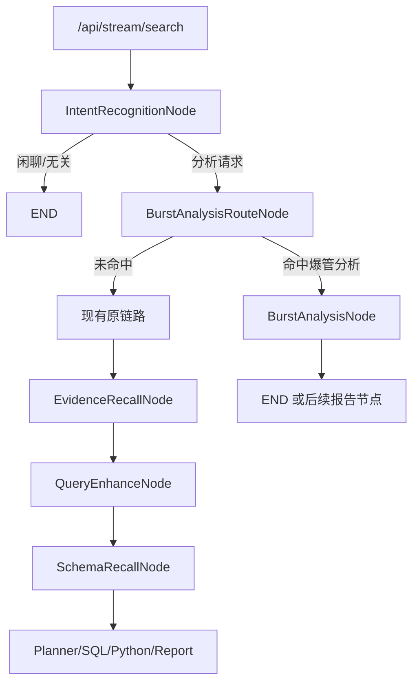

# 爆管分析意图分流与上下文保持方案

## 1. 目标

当前 `/api/stream/search` 已经具备完整的流式分析链路和多轮 `threadId` 上下文能力。现在希望在现有流程中增加一层判断：

- 用户问题如果涉及“爆管分析”，则走后续接入的专用接口
- 如果不涉及“爆管分析”，则继续走现有 NL2SQL / Planner / SQL / Python 原链路
- 无论走哪条分支，都尽量保持同一会话里的上下文连贯

这份文档给出的方案，目标是：

- 尽量少改现有 `/api/stream/search` 主链路
- 不破坏当前“闲聊/无关指令”和“数据分析请求”的判断逻辑
- 让后续追问仍然能基于同一个 `threadId` 连续理解上下文
- 为后续“爆管分析接口”接入预留稳定扩展点

## 2. 当前代码里的最佳插入点

现有主流程是：

1. 前端 `AgentRun.vue` 发起 `/api/stream/search`
2. 后端 `GraphController.streamSearch()` 组装 `GraphRequest`
3. `GraphServiceImpl.graphStreamProcess()` 生成或复用 `threadId`
4. `handleNewProcess()` 构建 graph state，注入 `MULTI_TURN_CONTEXT`
5. Graph 从 `IntentRecognitionNode` 开始执行
6. `IntentRecognitionDispatcher` 目前只做二分：
   - 闲聊/无关 -> `END`
   - 可能的数据分析请求 -> `EVIDENCE_RECALL_NODE`

对应关键代码位置：

- `data-agent-management/src/main/java/com/alibaba/cloud/ai/dataagent/controller/GraphController.java`
- `data-agent-management/src/main/java/com/alibaba/cloud/ai/dataagent/service/graph/GraphServiceImpl.java`
- `data-agent-management/src/main/java/com/alibaba/cloud/ai/dataagent/config/DataAgentConfiguration.java`
- `data-agent-management/src/main/java/com/alibaba/cloud/ai/dataagent/workflow/node/IntentRecognitionNode.java`
- `data-agent-management/src/main/java/com/alibaba/cloud/ai/dataagent/workflow/dispatcher/IntentRecognitionDispatcher.java`
- `data-agent-management/src/main/java/com/alibaba/cloud/ai/dataagent/service/graph/Context/MultiTurnContextManager.java`

## 3. 推荐方案

### 3.1 总体建议

推荐采用“两级路由”而不是直接把现有意图识别改成三分类。

也就是：

- 第一级：保留现有 `IntentRecognitionNode`
  - 只负责判断“是不是分析类请求”
- 第二级：在其后新增“爆管分析分流节点”
  - 只负责判断“分析类请求里，是否属于爆管分析”

推荐原因：

- 当前 `IntentRecognitionNode` 的 prompt 明显是“高召回”设计，目标是尽量不要误杀分析请求
- 如果直接把它从二分类改成三分类，容易影响现有“闲聊/分析”边界
- 把“爆管分析”作为第二层路由，风险更小，也更容易灰度

### 3.2 推荐后的流程



## 4. 具体改造设计

### 4.1 新增一个专门的“爆管分流节点”

建议新增：

- `BurstAnalysisRouteNode`
- `BurstAnalysisDispatcher`

职责：

- 输入：`INPUT_KEY`、`MULTI_TURN_CONTEXT`
- 输出：
  - `ROUTE_SCENE`
  - `ROUTE_CONFIDENCE`
  - `ROUTE_REASON`

推荐的路由结果至少有两个：

- `BURST_ANALYSIS`
- `DEFAULT_GRAPH`

如果后续还会扩展其他专用能力，也可以一开始就设计成：

- `BURST_ANALYSIS`
- `DEFAULT_GRAPH`
- `OTHER_SPECIALIZED_API`

### 4.2 为什么不建议直接把现有 IntentRecognition 改成三分类

当前 `intent-recognition.txt` 的设计重点是：

- 只拦截明确闲聊/无关内容
- 只要像分析请求，就尽量放行

这意味着它本身是“保守放行”的前置过滤器，不适合同时承担精细业务分流职责。  
如果把“爆管分析”直接塞进这里，会让一个本来只做粗分流的节点承受太多业务语义判断。

因此更稳的做法是：

- 继续让 `IntentRecognitionNode` 保持粗粒度判断
- 爆管判断交给新增的 `BurstAnalysisRouteNode`

### 4.3 爆管分流节点建议采用“规则 + LLM”混合判断

建议不要只用关键词，也不要只用 LLM，最好做成混合策略。

建议顺序：

1. 先做规则快速判断
   - 明确关键词：`爆管`、`爆裂`、`漏损定位`、`事故管段`、`影响范围`、`关阀`、`停水范围`、`抢修` 等
   - 明确业务对象：管段、阀门、节点、影响用户、停水区域、事故点位等
2. 再做 LLM 判断
   - 结合 `multi_turn` 看用户当前追问是不是在延续上一轮爆管分析
3. 最终输出路由场景和置信度

原因：

- 规则判断快，适合拦住高确定性场景
- LLM 适合处理“这个问题本轮没提爆管，但其实在追问上一轮事故分析”的情况
- 二者结合更适合多轮上下文

### 4.4 爆管分析接口建议封装成独立服务层

建议新增：

- `service/burst/BurstAnalysisService.java`
- `service/burst/impl/BurstAnalysisServiceImpl.java`

由 `BurstAnalysisNode` 调用该服务，而不是在 Node 里直接写 HTTP 细节。

这样做的好处：

- 后续接口地址、鉴权、超时、重试可以独立管理
- 当前接口未接入时，可以先给出 stub/mock 实现
- 如果后面要切换成另一个爆管服务，不需要动 Graph 路由逻辑

接口建议输入：

- `threadId`
- `agentId`
- `query`
- `multiTurnContext`
- 可选：上一轮路由场景、上游 sessionId、业务租户信息

接口建议输出：

- `answer`
- `summary`
- `structuredData`
- `routeScene`
- `upstreamSessionId` 或 `upstreamTraceId`

## 5. Graph 层需要怎么改

### 5.1 Constant 中新增状态键和节点名

建议在 `Constant.java` 中新增：

- `BURST_ANALYSIS_ROUTE_NODE`
- `BURST_ANALYSIS_NODE`
- `BURST_ANALYSIS_ROUTE_OUTPUT`
- `ROUTE_SCENE`
- `ROUTE_CONFIDENCE`
- `ROUTE_REASON`
- `BURST_ANALYSIS_API_OUTPUT`
- `THREAD_ROUTE_CONTEXT`

说明：

- `ROUTE_SCENE` 用于本轮决策
- `THREAD_ROUTE_CONTEXT` 用于线程级别上下文延续
- `BURST_ANALYSIS_API_OUTPUT` 用于后续回答生成或总结

### 5.2 DataAgentConfiguration 中新增节点和边

建议在 `nl2sqlGraph()` 中调整为：

1. `START -> INTENT_RECOGNITION_NODE`
2. `INTENT_RECOGNITION_NODE`
   - 闲聊/无关 -> `END`
   - 分析请求 -> `BURST_ANALYSIS_ROUTE_NODE`
3. `BURST_ANALYSIS_ROUTE_NODE`
   - 命中爆管分析 -> `BURST_ANALYSIS_NODE`
   - 未命中 -> `EVIDENCE_RECALL_NODE`

这样能保持现有原链路基本不动，只是在 `EvidenceRecallNode` 之前插入一个新分支。

### 5.3 BurstAnalysisNode 建议输出方式

如果爆管接口本身不是流式接口，建议在 `BurstAnalysisNode` 内部把结果包装成流式块输出，和现有节点一样通过 SSE 返回。

这样前端 `AgentRun.vue` 不需要额外改另一套接收协议，只要像接收普通 `GraphNodeResponse` 一样接收即可。

最稳的方式是：

- `nodeName = BurstAnalysisNode`
- `textType = MARK_DOWN` 或 `TEXT`
- 最终仍走当前 SSE 输出通道

## 6. 如何保持上下文连贯

这是这次改造里最关键的部分。

### 6.1 第一原则：不要换 threadId

当前前端和后端已经把连续对话都锚定在同一个 `threadId` 上：

- 前端 `sessionState.lastRequest.threadId` 会在下一轮请求继续带回
- 后端 `GraphServiceImpl.graphStreamProcess()` 会基于 `threadId` 查找上下文
- `MultiTurnContextManager` 也是按 `threadId` 维护历史

因此：

- 爆管命中后不要新开线程
- 不要为爆管接口单独生成新的会话 id 替代 `threadId`
- 应该继续复用当前 `/api/stream/search` 的 `threadId`

### 6.2 第二原则：线程里要记录“本轮走了哪条分支”

现在的多轮上下文有一个重要特点：

- `MultiTurnContextManager` 当前主要记录的是“用户问题 + PlannerNode 输出”
- 也就是说，它天然更偏向原有 Planner 链路

问题在于：

- 如果用户这轮走的是 `BurstAnalysisNode`
- 当前代码并不会像 `PlannerNode` 那样自动把这轮结果写进 `history`
- 那么下一轮再追问时，多轮上下文可能丢失这轮爆管分析结论

所以这里必须补强。

### 6.3 推荐把 MultiTurnContextManager 扩展成“通用回合摘要”

当前 `MultiTurnContextManager` 最好扩展成下面的结构：

- `userQuestion`
- `routeScene`
- `assistantSummary`

而不是只存 `planner output`。

推荐做法：

1. `beginTurn(threadId, userQuestion)` 保留
2. 新增：
   - `setRouteScene(threadId, routeScene)`
   - `appendAssistantChunk(threadId, chunk)`
   - `finishTurn(threadId)`
3. `buildContext(threadId)` 拼接成：
   - 用户问题
   - 本轮场景
   - AI 摘要

建议格式：

```text
用户: 上一轮问题
场景: BURST_ANALYSIS
AI摘要: 识别到事故管段为XX，建议关闭阀门A/B，影响范围为XX
```

对于原来的默认链路：

- 可以继续把 `PlannerNode` 输出作为 `assistantSummary`
- 或者在最终 `ReportGeneratorNode` 输出中截取摘要写入

对于爆管分支：

- 可以把接口返回中的 `summary`
- 或爆管结果的压缩摘要
- 写入 `assistantSummary`

这样后续用户再问：

- “这个影响范围里有多少用户？”
- “那要关哪些阀门？”
- “如果换成另一条支线呢？”

模型就能知道上一轮其实是在做爆管分析，而不是普通表查询。

### 6.4 第三原则：线程级路由上下文要写入 graph state

仅靠 `MULTI_TURN_CONTEXT` 还不够，建议把本轮路由也写入 graph state，例如：

- `ROUTE_SCENE = BURST_ANALYSIS`
- `THREAD_ROUTE_CONTEXT = BURST_ANALYSIS`

用途：

- 本轮内节点可直接读取，不必每次从多轮文本里反推
- 后续如果某些节点要基于场景切 prompt，会更方便
- 为以后扩展“爆管分析后再转 SQL 查询”做准备

### 6.5 第四原则：如果上游爆管接口也维护会话，要把 threadId 透传过去

如果后续接入的爆管接口本身有会话概念，建议：

- 把当前 DataAgent 的 `threadId` 作为外部接口的 `conversationId`
- 或在外部接口 session 和本地 `threadId` 之间做映射

不要让外部接口自己无关联地产生新 session。

否则会出现两个问题：

- DataAgent 觉得自己是同一轮连续追问
- 外部爆管服务却把它当成全新问题

最终上下文会断开。

### 6.6 第五原则：如果要支持刷新/重启后的连续性，需要持久化 thread 路由摘要

当前代码里的多轮上下文主要在内存中：

- 前端：`sessionStateManager`
- 后端：`MultiTurnContextManager`

这意味着：

- 页面不刷新时，多轮上下文是连续的
- 后端不重启时，多轮上下文也是连续的
- 但浏览器刷新、服务重启后，内存态会丢

如果后续你要求“刷新页面后仍能延续爆管分析上下文”，建议持久化：

- `threadId`
- `routeScene`
- `assistantSummary`
- 可选：外部爆管接口 sessionId

落点建议：

- 先写到聊天消息 `metadata`
- 或单独建一张 `thread_context` 表

## 7. 为什么只改前端不够

这类需求不能只在前端做“命中爆管就切另一个接口”。

原因：

1. 当前多轮上下文主要在后端按 `threadId` 维护
2. 人工反馈、停止流式、graph 恢复都在后端
3. 如果前端绕过 `/api/stream/search` 直接打另一个接口，当前 graph state 不会知道这轮做了什么
4. 下一轮再回来走原 graph 时，上下文会断

所以更推荐：

- 仍然从 `/api/stream/search` 进入
- 在 Graph 内部完成分流
- 对外部爆管接口做 Node 级适配

这样上下文最完整。

## 8. 推荐的改造文件清单

### 8.1 必改

- `data-agent-management/src/main/java/com/alibaba/cloud/ai/dataagent/constant/Constant.java`
- `data-agent-management/src/main/java/com/alibaba/cloud/ai/dataagent/config/DataAgentConfiguration.java`
- `data-agent-management/src/main/java/com/alibaba/cloud/ai/dataagent/service/graph/Context/MultiTurnContextManager.java`
- `data-agent-management/src/main/java/com/alibaba/cloud/ai/dataagent/service/graph/GraphServiceImpl.java`

### 8.2 新增

- `data-agent-management/src/main/java/com/alibaba/cloud/ai/dataagent/workflow/node/BurstAnalysisRouteNode.java`
- `data-agent-management/src/main/java/com/alibaba/cloud/ai/dataagent/workflow/dispatcher/BurstAnalysisDispatcher.java`
- `data-agent-management/src/main/java/com/alibaba/cloud/ai/dataagent/workflow/node/BurstAnalysisNode.java`
- `data-agent-management/src/main/java/com/alibaba/cloud/ai/dataagent/dto/prompt/BurstAnalysisRouteOutputDTO.java`
- `data-agent-management/src/main/resources/prompts/burst-analysis-route.txt`
- `data-agent-management/src/main/java/com/alibaba/cloud/ai/dataagent/service/burst/BurstAnalysisService.java`
- `data-agent-management/src/main/java/com/alibaba/cloud/ai/dataagent/service/burst/impl/BurstAnalysisServiceImpl.java`

### 8.3 可选增强

- `data-agent-management/src/main/java/com/alibaba/cloud/ai/dataagent/dto/GraphRequest.java`
- `data-agent-frontend/src/services/graph.ts`
- `data-agent-frontend/src/services/sessionStateManager.ts`
- `data-agent-frontend/src/views/AgentRun.vue`

说明：

- 如果只是后端图内分流，前端可以先不改
- 如果想在界面上展示“当前命中的是爆管分析场景”，再考虑给 `GraphNodeResponse` 或消息 metadata 增加 route 信息

## 9. 建议的实现步骤

### 第一步：先做后端图内分流，不接真实接口

先把这几个东西跑通：

- `BurstAnalysisRouteNode`
- `BurstAnalysisDispatcher`
- Graph 新边
- `MultiTurnContextManager` 的通用摘要能力

这一步先让 `BurstAnalysisNode` 返回固定 mock 内容即可。  
先验证两件事：

- 分流是否准确
- 爆管分支执行后，下一轮追问是否还能连续理解

### 第二步：再接真实爆管接口

把 mock 的 `BurstAnalysisServiceImpl` 换成真实 HTTP 调用，补上：

- URL
- 鉴权
- 超时
- 错误处理
- 重试策略
- 上游会话透传

### 第三步：按需要决定是否持久化线程上下文

如果只是同页连续追问，这一步可以先不做。  
如果要求浏览器刷新或后端重启后仍连续，则补：

- `thread_context` 持久化
- 启动时恢复
- 聊天消息 metadata 回灌

## 10. 风险点

### 10.1 最大风险：爆管分支执行后，多轮上下文没入历史

这是最容易被忽略的问题。  
如果只加路由，不扩展 `MultiTurnContextManager`，当前爆管结果很可能不会进入后续 prompt 的多轮上下文。

### 10.2 第二个风险：外部接口另起 session

如果爆管接口自己维护上下文，但不接受本地 `threadId`，会导致两边会话脱节。

### 10.3 第三个风险：直接改现有 IntentRecognitionPrompt

如果把原来的粗粒度节点改得太复杂，可能影响所有现有分析场景的放行率。

## 11. 最终建议

如果目标是“可控接入、风险小、上下文连续”，最推荐的落地方案是：

1. 保留现有 `IntentRecognitionNode` 作为粗粒度分析入口
2. 在它后面新增 `BurstAnalysisRouteNode`
3. 命中后进入 `BurstAnalysisNode`，由该节点适配后续真实接口
4. 全程复用同一个 `threadId`
5. 扩展 `MultiTurnContextManager`，把“爆管结果摘要”也写进线程历史
6. 如需跨刷新/重启连续，再把 `threadId + routeScene + summary` 持久化

## 12. 结论

这件事的关键不是“多接一个接口”，而是“把新分支纳入现有 threadId 和多轮上下文体系”。  
只要坚持这两个原则：

- 路由发生在 Graph 内部
- 上下文仍以同一个 `threadId` 为主线

那么无论后续接的是爆管分析、漏损分析，还是其他专用业务接口，都可以保持会话连贯，不会把当前 `/api/stream/search` 的上下文机制打散。

## 13. 当前仓库结论补充

基于当前仓库代码检索结果，可以确定：

- 现有 `/api/stream/search`、`threadId`、`MultiTurnContextManager` 已经足够支撑图内分流
- 当前 `IntentRecognitionNode` 只有“闲聊/无关”与“分析请求”二分类
- 当前多轮上下文主要记录“用户问题 + Planner 输出”
- 当前后端业务代码中，未看到已经成型的“爆管分析接口适配层”实现，因此更适合先按本文档方式预留接入层

