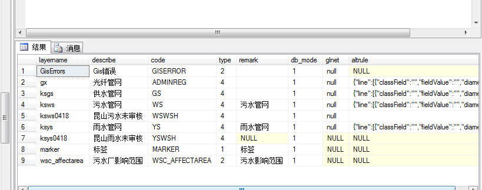
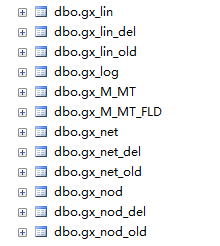
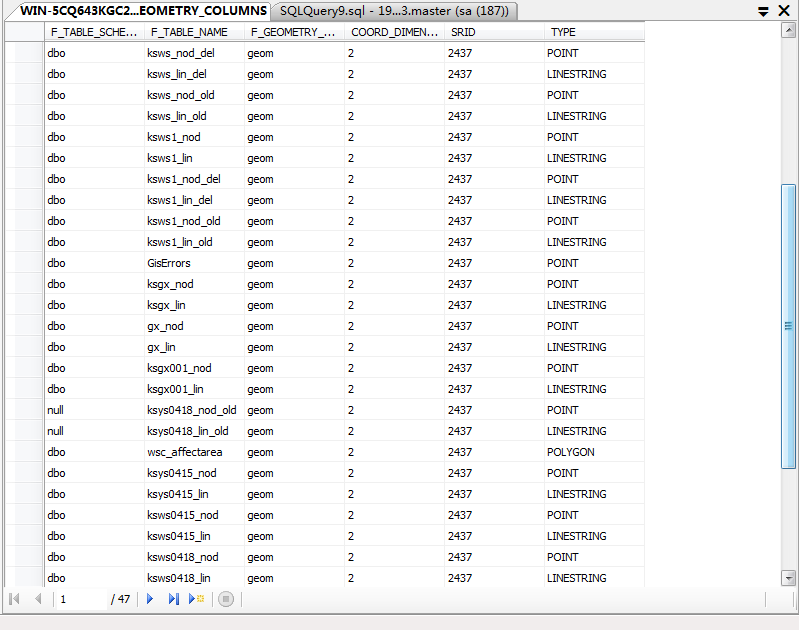
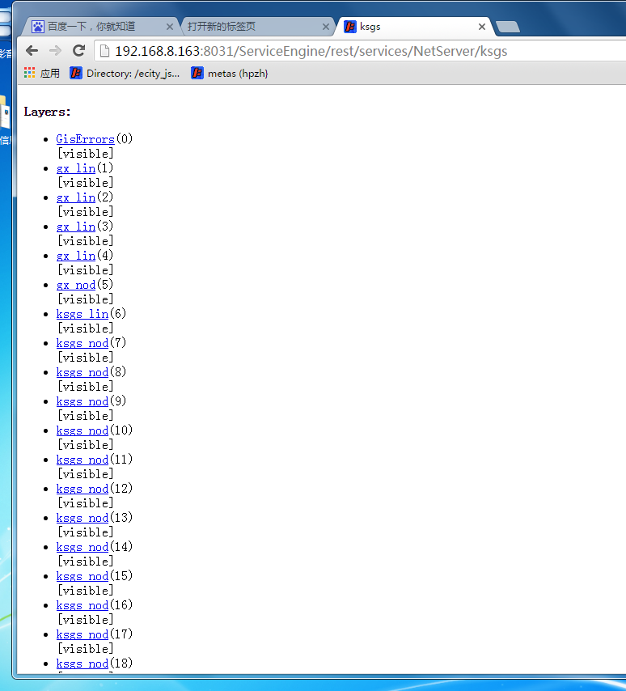
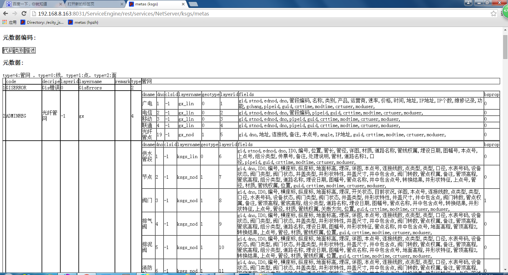

# sql server 管网元数据配置

| 版本 | 时间 | 修改人 | 说明 |
|----|----|----|----|
| 2.0.4 | 2021-06-18 | 田楠 | 修复关于管线描述问题 |
| 2.0.3 | 2020-11-26 | 蔡忠杰 | 1.样式格式调整 |
| 2.增加空间元数据code码标准表 |    |    |    |
| 2.0.2 | 2019-05-27 | 田楠 | 更新元数据服务地址 |
| 2.0.1 | 2019-03-04 | 田楠 | 修改链接地址，之前的地址服务已不存在 |
| 2.0.0 | 2018-08-29 | 陈慧 | 迁移至该网站 |

# 一、空间元数据说明

### 1.1 管网元数据简介

**管网元数据**是公司内的一种称呼，主要目的是用来统称带有空间信息的数据，普通数据就是一般我们接触到数据，例如用户名、用户密码等。而空间数据就是在普通数据的基础上再添加空间信息。 **管网元数据**分为管网元数据和要素元数据（即非管网元数据）。 点击此链接 [公司产品测试环境管网元数据](http://192.168.10.242:8878/hopeserver/rest/services/NetServer/sqgs/metas?f=json)，这里面看到的就是元数据的一些基本信息，元数据的所有查询都依赖于这张表所提供的信息。今天我们只需要看两个字段：`type` 和 `layerid`。可以看到 type=4：管网，type=0：线，type=1：点，type=2：面。管网元数据即 type=4，特点在于它可再细分为点、线。管网元数据的查询都是通过 layer.js 进行查询的，一般通过管网的 layerid 查询到该管网下的所有信息。

### 1.2 空间元数据code码标准

| 代码 | 类别 |
|----|----|
| ADMINREG | 行政区域 |
| ATTACHMENT | 要素附件 |
| DX | 电信 |
| GA | 公安 |
| GD | 广电 |
| GY | 工业 |
| HS | 雨污合流 |
| JS | 供水 |
| LD | 路灯 |
| LOCLIB | 地名库 |
| LOCREG | 定位区 |
| PD | 配电 |
| PROJECT | 工程要素 |
| PS | 排水 |
| RL | 热力 |
| ROADLINE | 道路中心线 |
| RQ | 燃气 |
| RS | 热水 |
| SHEET | 图幅 |
| TY | 通用 |
| WS | 污水 |
| XH | 交通 |
| YD | 输电 |
| YS | 雨水 |
| ZH | 综合管廊 |
| ZQ | 蒸汽 |

# 二、元数据的配置

### 2.1 表 dbo.M_DBMETA 配置元数据

该表的字段说明： **layername**:非管网（type 不为 4）的元数据配置 ，layername 即为数据表名，管网元数据的配置下，layername 即为表名称的前缀，例如 `gx_lin`,`gx_nod`...gx 就为管网元数据配置的 layername; **describe**:元数据的别名； **code**:该条数据的代号； 非管网的数据和 layername 一样，大写；管网的数据根据规定：例如，电视：DS,雨水：YS，燃气：RQ **type**：管网元数据的类型 **remark**:标签，可以不用 **bd_mode**,**glne**基本不用； **altrule**:插入规则，基本不管  

在此表中配置你需要添加的元数据，这里要注意的是`type`,这里就是指元数据中的 type，如果配置的管网是面，那么 type 就是 2，如果是管网，那么 type 就是 4。

## 每个元数据都会对应一张数据表，或者元数据下的管网。

type 为 4 的表示管网，管网下面又会分点、线，那么对应的管网元数据表也会分点、线，例如上面图中 type 为 4 的`光纤管网`，对应的管网元数据表有：

 

其中：

* `lin` 对应线，
* `lin_del` 是删除的线，
* `lin_old` 是废管，
* `lin_del` 和 `lin_old` 中的所有数据都是来自 `lin` 中；
* `net` 对应折线，
* `nod` 对应点，
* `M_MT` 是该类管网下对应的所有的管网信息，
* `M_MT_FLD` 是每个管网的所有字段的配置；

如果 type 为 0 或者 1 或者 2，那么可能就只有一张对应的元数据表，表名就为 layername，例如 type 为 2 的 wsc_affectarea 对应的元数据表是：`dbo.wsc_affectarea`，新建一个 dbo.wsc_affectarea 数据表，新建后，设计表，添加需要的字段以及字段的类型。元数据表中都会有 geom 字段，用来存储空间信息，那么也需要给元数据表中 geom 字段配置，用来说明这个 geom 是用来存储说明类型的空间信息。

## 表 dbo.GEOMETRY_COLUMNS 配置空间信息

配置 geom 的存储类型，如果表里面需要存储空间信息，就需要配置 geom 可以看到，该表中给每个元数据表都进行的配置  

`F_TABLE_SCHEMA` 为默认 `dbo`; `F_GEOMETRY_COLUMN` 默认为 `geom`; `COORD_DIMENSION` 一般为 2；`SRID` 为空间参考系；

其中需要注意的是 `F_TABLE_NAME` 和 `TYPE`, `F_TABLE_NAME` 是对应的元数据表名，这个地方要和你配置的表名一致，`TYPE` 就是用来配置元数据表中 geom 中存放是空间信息是什么类型的。点类型就为 `POINT`，线类型就为 `LINESTRING`，面类型就为 `POLYGON`

元数据的配置最少需要有这三个地方的配置

## 验证配置结果

这三个地方配置完成后，重启服务（例如重启 192.168.8.163 上的昆山供水 8031），然后打开 [http://192.168.8.113:8091/ServiceEngine/rest/services/NetServer/tgzf](http://192.168.8.113:8091/ServiceEngine/rest/services/NetServer/tgzf/metas)，可以看到，  

会多一个新配置的元数据，ws_affectarea(101)，`101` 是 layerid,这个是自动生成的，不需要配置，然后进入到元数据表信息页面 <http://192.168.8.113:8091/ServiceEngine/rest/services/NetServer/tgzf/metas>：  

可以看到，在最下面，也会多一个新配置的元数据，至此，元数据的配置就基本完成了。